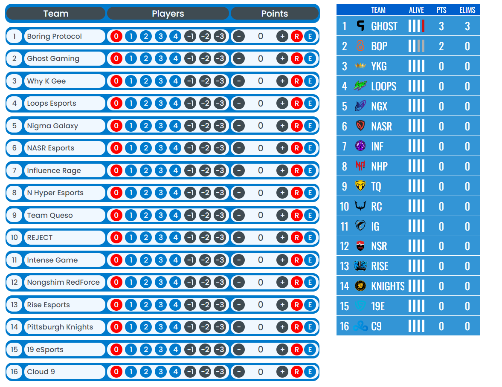

# Scoring Table with Team Elimination Broadcast




## How to import team data
In the `team_data` folder there is `config.json` where you can set teams background color and scoring table's header color in the `"table_data"`. You can upload team logos in `team_logos` folder and set team data in the `config.json` file in `"team_data"` (use the already put data as an example)

## Installing the packages
Run the following in the terminal.
```
npm i
```

## Setting up the database
In order to save team points, you will need to set up SQLite database by running `npx ts-node database/db_setup.ts` in the terminal. **NOTE** You will also need to re-run this command if you change the number of teams in the `config.json` file.

## Starting a react app
You will need to run react app with the backend server. In order to do that split the terminal and do the following.

first terminal
```
npm start
```

second terminal
```
npm run server
```

**NOTE** Whenever you change team data (team names, team logos) you will need to restart the backend server.

Developed by [CCXLV](https://github.com/CCXLV/)
